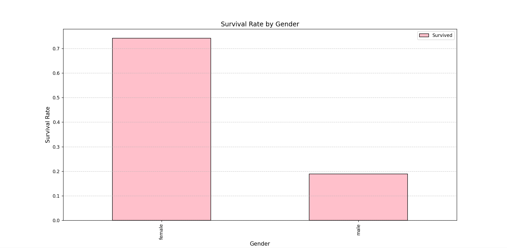
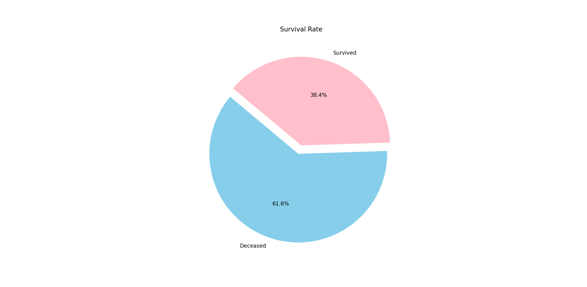

# Titanic Survival Data Visualization

This project analyzes the Titanic dataset and visualizes survival statistics using Python libraries: Pandas, NumPy, and Matplotlib.

## Features
- Survival rate visualization by gender using bar charts.
- Survival rate visualization by status (survived vs. not survived) using pie charts and bar charts.
- Insights into the Titanic dataset through statistical analysis.

## Installation
1. Clone this repository:
    ```bash
    git clone <repository_url>
    ```
2. Install required Python libraries:
    ```bash
    pip install pandas matplotlib openpyxl
    ```

## Usage
1. Place the Titanic dataset file (`titanic.xlsx`) in the project directory.
2. Run the Python script to generate visualizations:
    ```bash
    python titanic_analysis.py
    ```

## Dataset
The Titanic dataset (`titanic.xlsx`) contains the following important columns:
- **Survived**: Survival status (0 = No, 1 = Yes).
- **Pclass**: Passenger class (1 = First, 2 = Second, 3 = Third).
- **Sex**: Gender of the passenger.
- **Age**: Age of the passenger.
- **Fare**: Ticket fare.
- **Embarked**: Port of embarkation (C = Cherbourg, Q = Queenstown, S = Southampton).

## Visualizations
- **Bar Chart**: Survival rate by gender and Survival rate by Passenger Class.
- **Pie Chart**: Proportion of survivors vs. non-survivors.

## Example Outputs
### Bar Chart: Survival Rate by Gender


### Pie Chart: Survival vs. Non-Survivors

